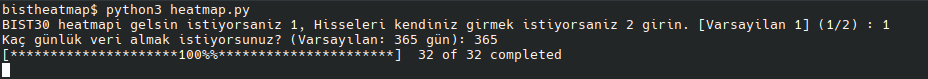
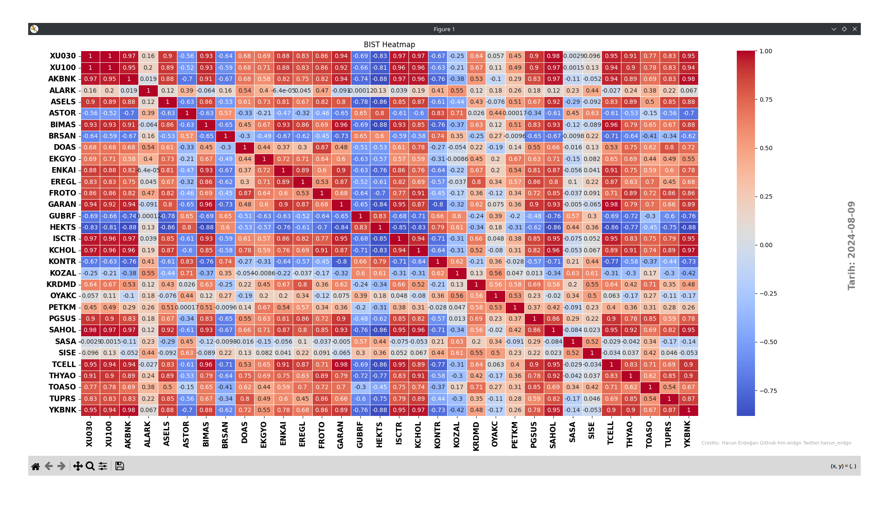
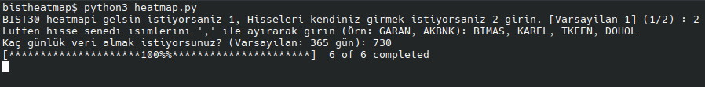
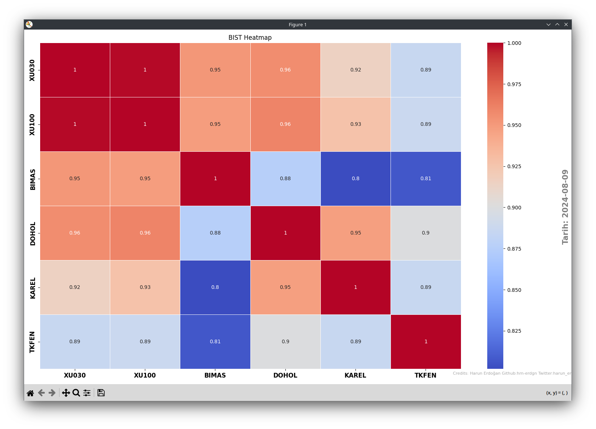

# Hisse Senetleri ve Endeksler için Korelasyon Heatmap'i

Bu proje, hisse senetleri ve endeksler arasında korelasyonları görselleştirmek için bir Python scripti sağlar. Kullanıcı, manuel olarak hisse senedi sembollerini girebilir veya BIST 30 endeksine dahil olan hisse senetlerini otomatik olarak kullanabilir. Ayrıca, kullanıcı belirli bir zaman aralığı seçebilir ve heatmap'te korelasyonları inceleyebilir.

## Özellikler

- **Hisse Seçimi**: Hisse senetlerini manuel olarak girme veya BIST 30 hisselerini otomatik olarak seçme imkanı.
- **Dinamik Zaman Aralığı**: Kullanıcı, veri çekilecek zaman aralığını (gün olarak) belirleyebilir. Varsayılan olarak 365 gün kullanılır.
- **Korelasyon Heatmap'i**: Seçilen hisse senetleri ve XU30 ile XU100 endeksleri arasındaki korelasyonlar bir heatmap üzerinde görselleştirilir.

## Kurulum

1. **Gereksinimler**: Bu script Python 3.x ile çalışır. Gerekli kütüphaneler:
   - `yfinance`
   - `pandas`
   - `seaborn`
   - `matplotlib`

2. **Kütüphanelerin Yüklenmesi**:
   ```
   pip install yfinance pandas seaborn matplotlib
   ```
3. **Scriptin Çalıştırılması**:
   ```
   python heatmap.py
   ```
   **BIST30 İçin Komut Satırı**:
   
   
   **BIST30 HEATMAP:**
   


   **Spesifik Hisseler İçin Komut Satırı:**

   

   **Hisseler HEATMAP:**
   


   
